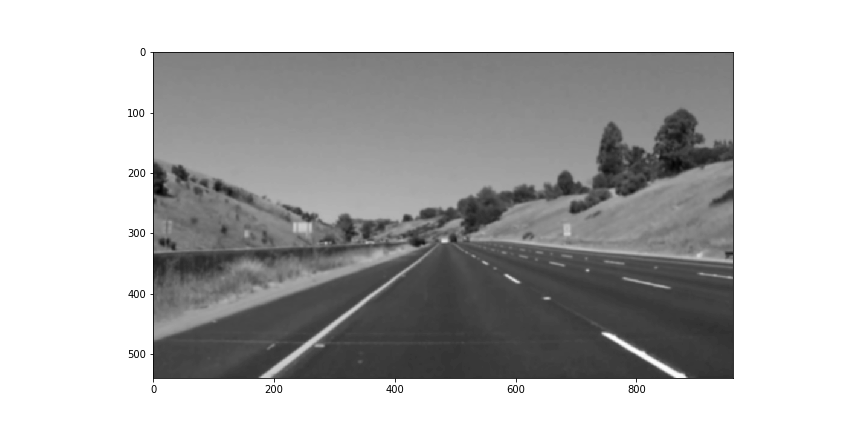
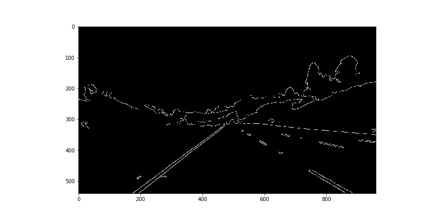
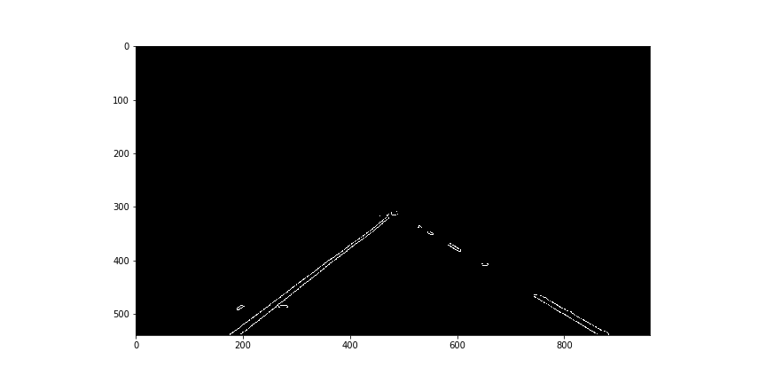
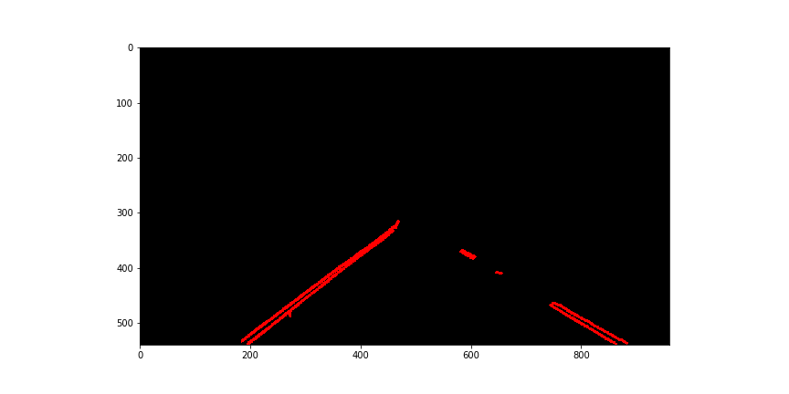
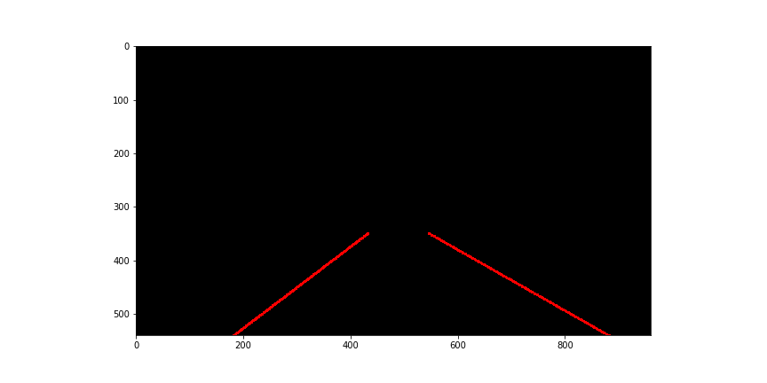
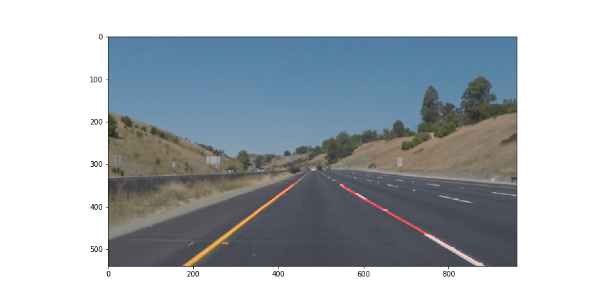

# **Finding Lane Lines on the Road**

The goals / steps of this project are the following:
* Make a pipeline that finds lane lines on the road
* Reflect on your work in a written report

---

## Reflection

### 1. Pipeline

My pipeline consisted of following steps:
* Convert image to grayscale

* Apply gaussian blur

* Apply Canny transformation to find edges 

* Clip with polygon mask to only use relevant portion of image

* Find segments using HoughLinesP

* Draw segments on image

In order to draw a signle lin on left and right lanes, I modified hough_lines function by adding following steps:
* Filter segments with extreme angles and separate tham into two bins (left and right)
* Average left and rigth segments into lines if there are enough segments to represent line

### 2. Identify potential shortcomings with your current pipeline

Car expects to see only two lines, if there are more they will be averaged incorectly.
Sharp turns will result in dissappearing lines.
If camera changes position there will be need in recalibrating.

### 3. Suggest possible improvements to your pipeline

When approximating lines use not only current image, but also results from previous images.
Improve approximation by using not a number of segments, but their total length as threshold.
Filter lines by colour to improve accuracy.
